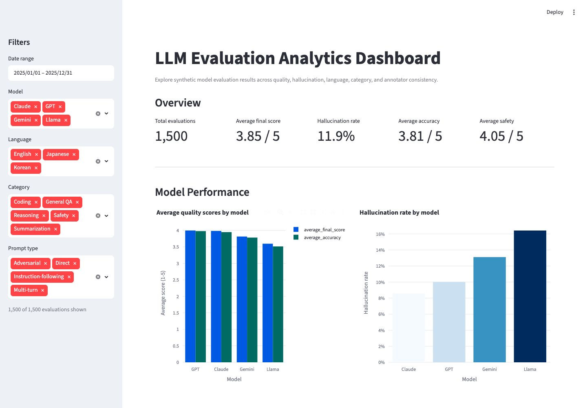
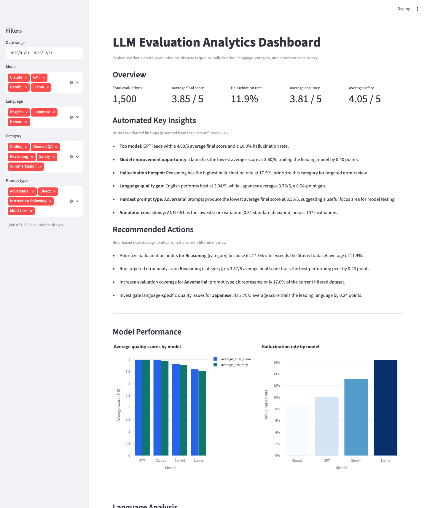

# LLM Evaluation Analytics Dashboard

> An AI Evaluation Analytics portfolio project that turns structured model evaluation data into quality signals, risk findings, and recommended actions.

## Project Overview

This project simulates how an AI Evaluation or Data Quality team can monitor LLM performance across models, languages, task categories, prompt types, and annotators.

The Streamlit dashboard analyzes 1,500 synthetic evaluation records and converts them into:

- Executive quality KPIs
- Model and segment performance comparisons
- Hallucination risk signals
- Annotator consistency metrics
- Automated business insights and recommended actions

## Business Problem

LLM evaluation programs produce large volumes of annotation and scoring data, but raw records do not directly answer operational questions:

- Which models or task types require investigation?
- Where is hallucination risk concentrated?
- Are quality gaps emerging across languages?
- Is evaluation coverage balanced?
- Do annotators apply scoring criteria consistently?

Without a structured analytics workflow, teams can miss quality regressions, under-tested segments, and annotation inconsistencies.

## Solution

The dashboard uses Pandas to clean, filter, and aggregate evaluation records, then presents the results through interactive Plotly visualizations and Streamlit metrics.

All analyses respond to date, model, language, category, and prompt-type filters. Rule-based logic transforms the filtered metrics into concise findings and prioritized actions without using LLM APIs.

## Dashboard Features

- **Quality overview:** Evaluation volume, final score, accuracy, safety, and hallucination rate
- **Automated key insights:** Best and weakest models, risk categories, language gaps, prompt difficulty, and annotator consistency
- **Recommended actions:** Metric-backed next steps for audits, error analysis, calibration, and coverage expansion
- **Model analysis:** Quality and hallucination comparisons across four LLMs
- **Language analysis:** Performance, risk, and evaluation volume by language
- **Category analysis:** Lowest-performing tasks and hallucination hotspots
- **Annotator analysis:** Workload and scoring variance monitoring
- **Interactive filtering:** Every metric, chart, insight, and recommendation updates with the selected evaluation slice

## Example Insights

Examples generated from the included synthetic dataset:

- GPT leads model performance with a **4.00/5 average final score**.
- Llama trails the leading model by **0.40 points** and has a **16.4% hallucination rate**.
- Reasoning is the highest-risk category, with a **17.5% hallucination rate**.
- Japanese evaluations average **3.70/5**, compared with **3.94/5** for English.
- Adversarial prompts are the most difficult prompt type, averaging **3.53/5**.

## Example Recommended Actions

- Prioritize hallucination audits for Reasoning tasks.
- Run targeted error analysis on lower-performing model and category segments.
- Investigate language-specific quality gaps for Japanese evaluations.
- Increase evaluation coverage for underrepresented prompt types.
- Review annotator calibration when score variance exceeds team benchmarks.

## Screenshots

### Dashboard Overview



### Automated Insights and Recommended Actions



### Annotator Quality Analysis

_Add a screenshot showing workload and scoring consistency._

## Analysis Workflow

1. Generate reproducible synthetic LLM evaluation records.
2. Load and validate the CSV data with Pandas.
3. Apply interactive filters to define the analysis scope.
4. Aggregate quality, hallucination, coverage, and consistency metrics.
5. Present visual findings and generate rule-based recommendations.

## Tech Stack

**Python · Pandas · NumPy · Plotly · Streamlit · CSV**

No database, backend API, authentication, paid API, or external model service is used.

## Run Locally

```bash
python3 -m venv .venv
source .venv/bin/activate
pip install -r requirements.txt
python generate_data.py
streamlit run app.py
```

Open [http://localhost:8501](http://localhost:8501).

## Project Structure

```text
llm-evaluation-analytics-dashboard/
├── app.py
├── generate_data.py
├── data/llm_evaluation_data.csv
├── screenshots/
├── PRD.md
├── requirements.txt
└── README.md
```

## Project Summary

Built an LLM evaluation analytics dashboard that analyzes model quality, hallucination risk, multilingual performance, evaluation coverage, and annotator consistency, then converts those metrics into decision-ready insights and recommended actions.
